# Homework 3

## 1


## 2

### a

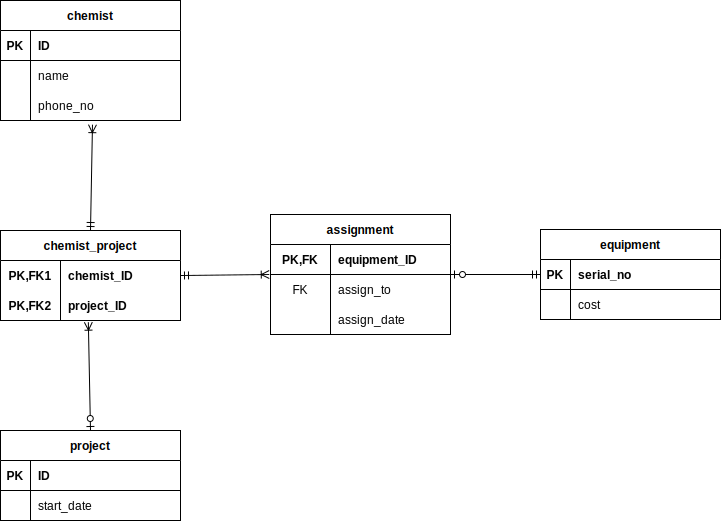

### b


### c

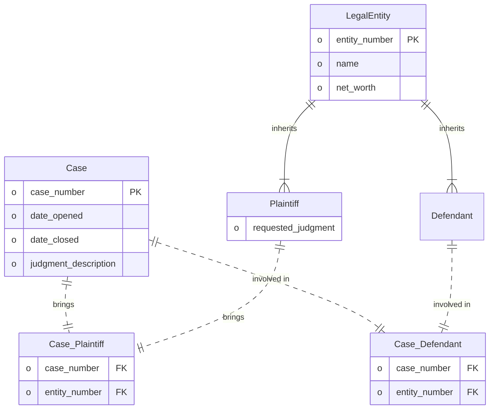

### d

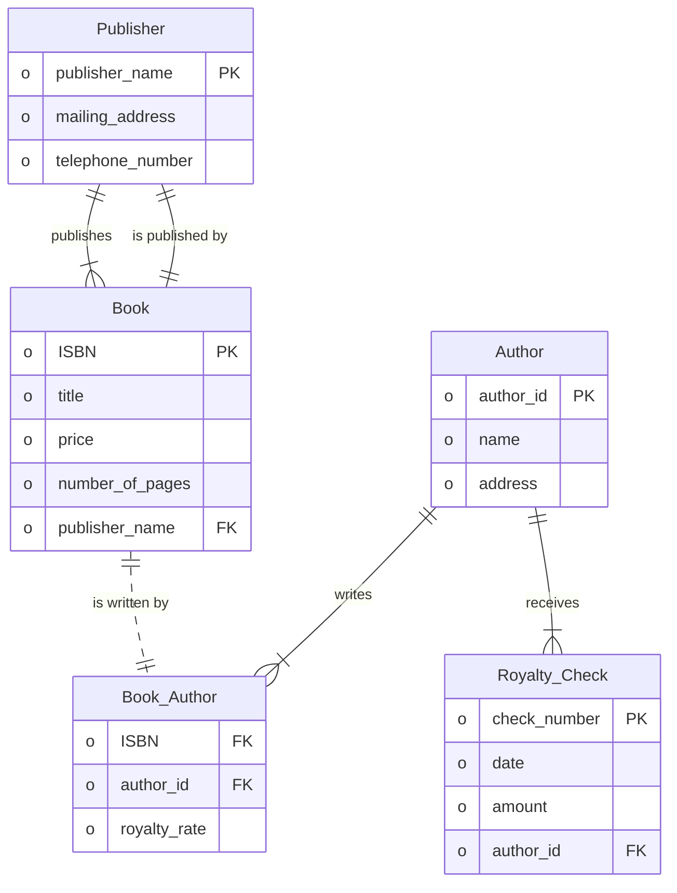

## 3

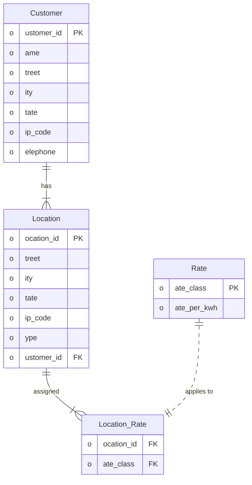

- A Customer can have multiple locations, so we create a one-to-many relationship between Customer and Location.
- Each location can have one or more rates, depending on the time of day. To represent this, we create a many-to-many relationship between Location and Rate using an associative entity called Location_Rate.
- Rate Class is used as a primary key for the Rate entity, assuming it uniquely identifies each rate.

## 4

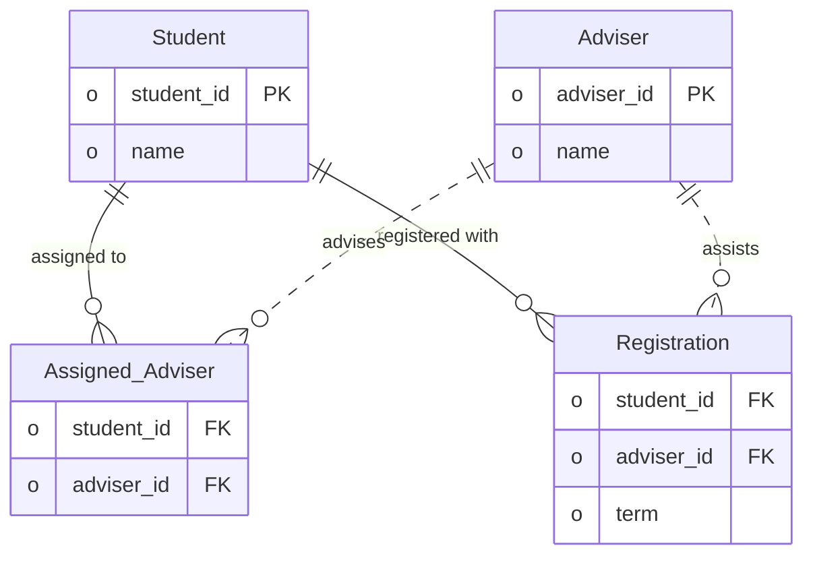

## 5

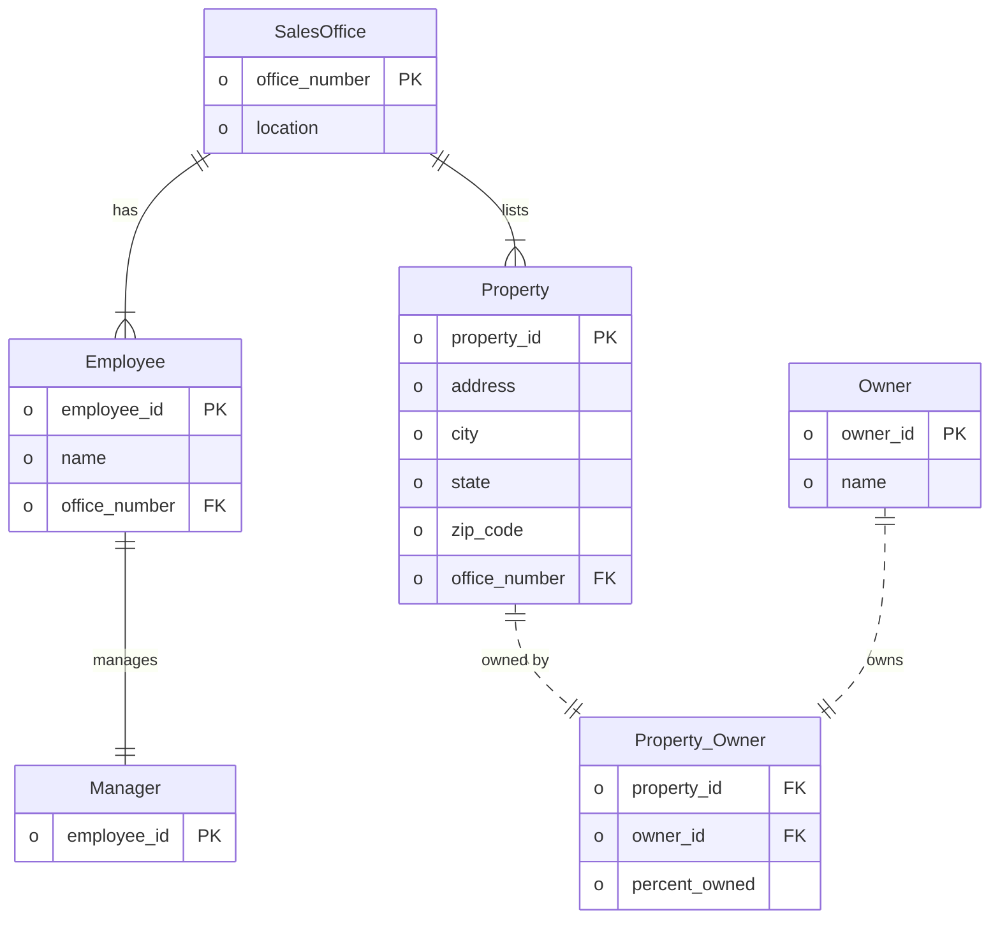

## 6

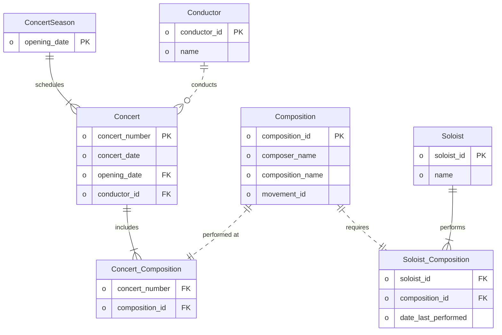

## 7

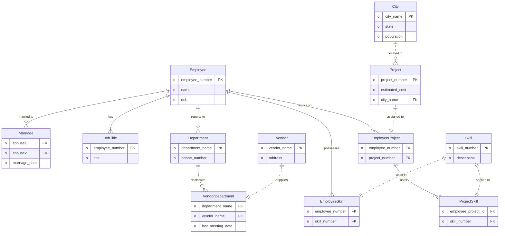

## 8

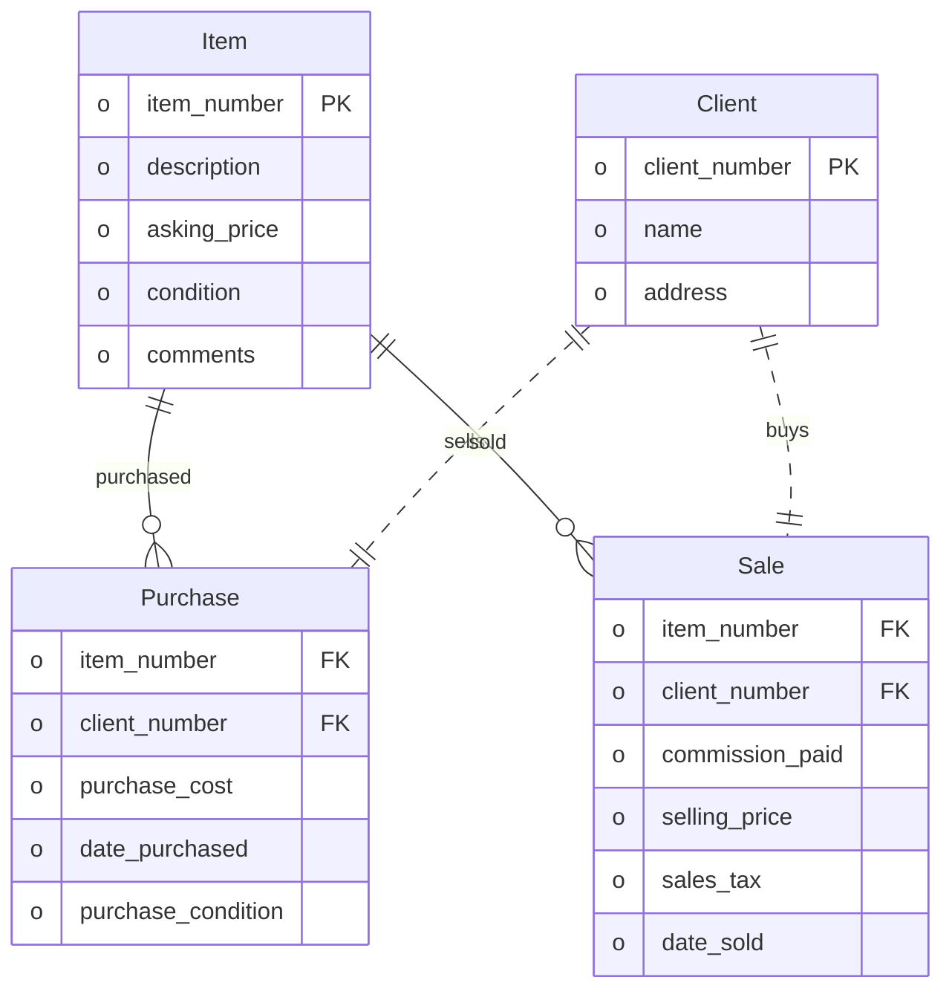

## 9

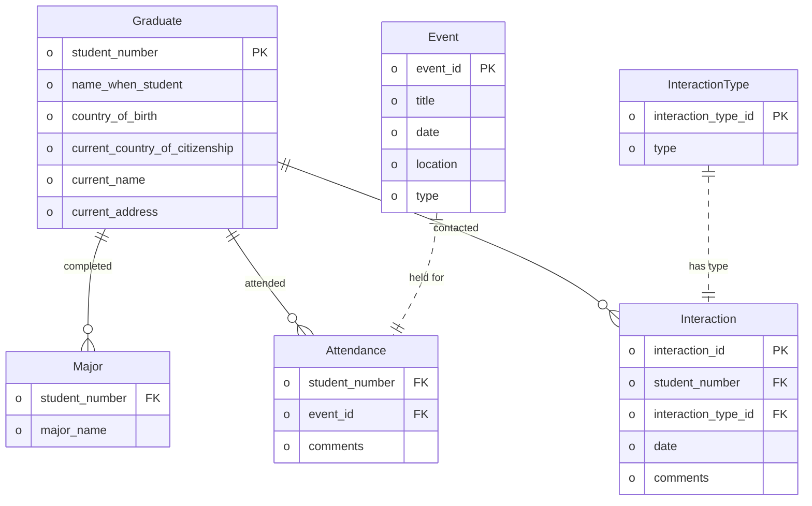

## 10

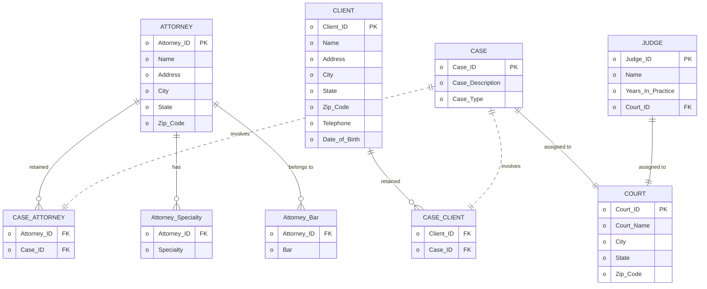

