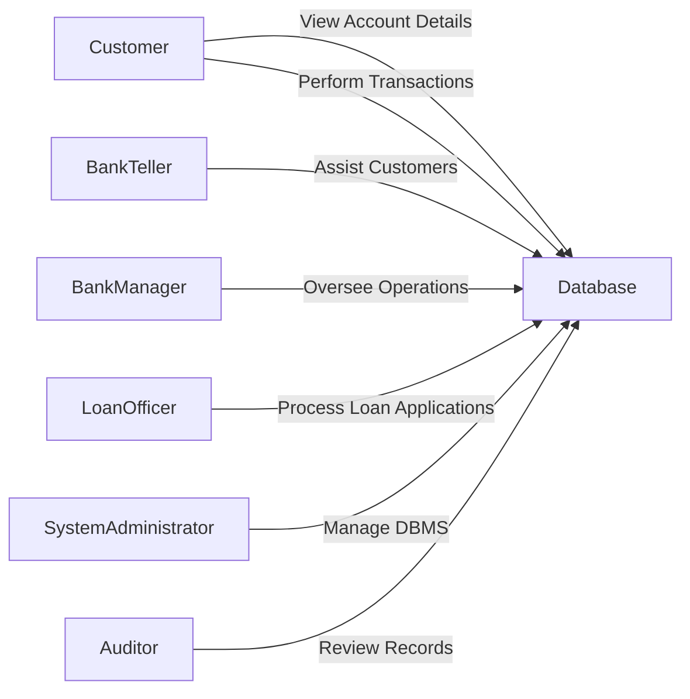
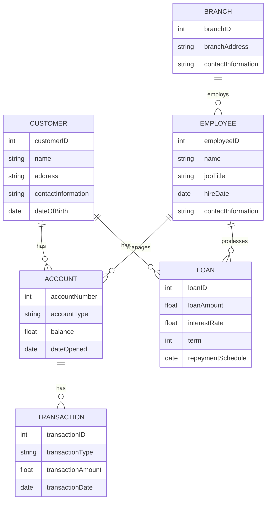

# README

Project for DAMG6210.

This repository will be valid for 2023 spring semester **ONLY** (then I will make private or remove it for good).

## Problem Statement

The banking industry requires efficient and reliable systems to manage and process a significant amount of data, such as customer information, account details, transactions, and employee data. The current systems may be slow, difficult to maintain, or not optimized for large-scale data processing. Therefore, there is a need for a comprehensive and well-organized database management system (DBMS) that can efficiently store and manage these data sets while providing optimized queries for faster processing and improved data management capabilities.

## Users of The System

There are several types of users in the banking system. Each user type has specific roles and permissions, depending on their responsibilities and job functions within the bank. Here are the main user types:

- Customer:

    A bank customer who holds one or more accounts with the bank. They can view their account details, transaction history, and personal information. Customers can also perform transactions, such as deposits, withdrawals, and fund transfers.

- Bank Teller:

    A bank employee who assists customers with various banking services, such as opening accounts, handling deposits and withdrawals, and providing account-related information.

- Bank Manager:

    A higher-level bank employee who oversees the day-to-day operations of the branch, monitors the performance of the tellers, and ensures that the bank meets its financial goals and regulatory requirements.

- Loan Officer:

    A bank employee responsible for reviewing and processing loan applications, evaluating the creditworthiness of potential borrowers, and determining loan terms and conditions.

- System Administrator:

    An IT professional who manages the bank's DBMS, ensuring its security, performance, and reliability. They are responsible for user management, database maintenance, and troubleshooting any technical issues.

- Auditor:

    An external or internal auditor who reviews the bank's financial records, processes, and systems to ensure compliance with regulatory requirements and industry best practices. They may need access to the DBMS to review transaction records, account details, and other relevant data.

## Use-Case Diagram

## Entities and Relationships

Entities are:

- Customer:

    Represents a bank customer with attributes such as customer ID, name, address, contact information, and date of birth.

- Account:

    Represents a bank account held by a customer with attributes like account number, account type (e.g., checking, savings), balance, and date of account opening.

- Transaction:

    Represents a financial transaction performed on an account, including attributes such as transaction ID, account number, transaction type (e.g., deposit, withdrawal, transfer), transaction amount, and transaction date.

- Employee:

    Represents a bank employee with attributes such as employee ID, name, job title, hire date, and contact information.

- Loan:

    Represents a loan granted to a customer with attributes like loan ID, customer ID, loan amount, interest rate, term, and repayment schedule.

- Branch:

    Represents a physical bank branch with attributes such as branch ID, branch address, and contact information.

Relationships are:

- Customer-Account:

    A customer can have one or more bank accounts, and each account belongs to one customer. This relationship is one-to-many.

- Account-Transaction:

    An account can have multiple transactions, and each transaction belongs to one account. This relationship is one-to-many.

- Employee-Branch:

    A bank employee works at one branch, and each branch has multiple employees. This relationship is one-to-many.

- Customer-Loan:

    A customer can have one or more loans, and each loan is granted to one customer. This relationship is one-to-many.

- Loan-Loan Officer:

    A loan officer can process multiple loans, and each loan is handled by one loan officer. This relationship is one-to-many.

## ER Diagrams

