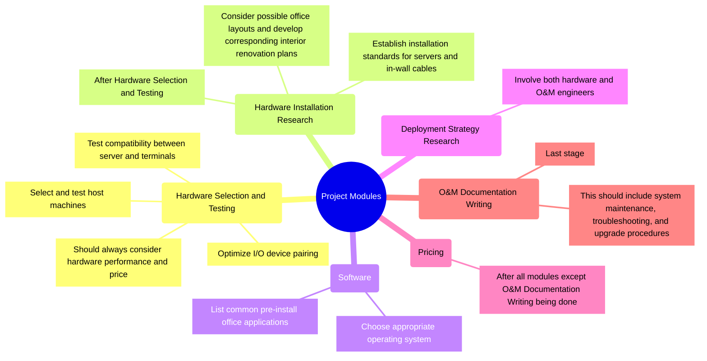
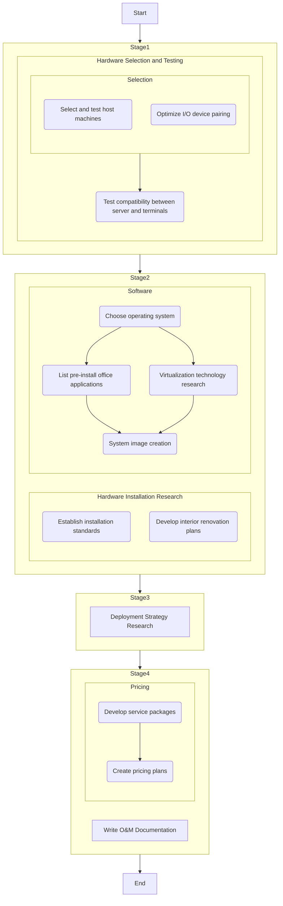
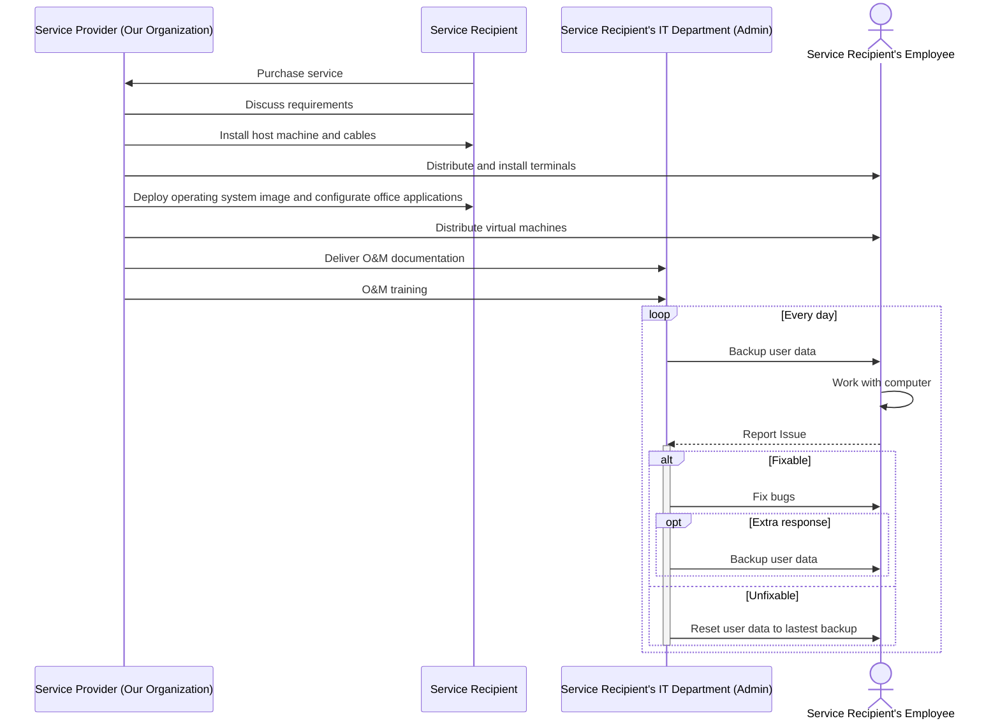

# Centralized Alternative Solution for Enterprise Computing Needs

[toc]

## Purpose

Computers are of great importance to all business companies. However, to those companies that are not in Information Technology industry, managing and maintaining office computer cluster is way harder than expected: because those computing devices are distributed to employees, the hardware/software maintenance is not guaranteed. Due to the sophisticated nature of computer and the ignorance of mass majority, office computers are frequently facing virus infections, business secret leaks, runtime environment conflicts, crashing and all other unexpected troubles. In fact, almost all companies have to set up a whole IT department with great cost to handle those problems, if and only if the problem is perceived by the user. This project mainly aims to provide a centralized computing service in order to reduce the occurrence of problems mentioned above and lower the cost of operations and maintenance.

## Objective

The main objective of this project is to set up a centralized server locally with terminals (a set of I/O devices such as keyboard, mouse, monitor, etc.) distributed to every employees' office that can only connect the server with pre-installed physical cables, instead of distributing complete computers (with host). Users (employees) can no longer get access to the hardware layer and their behaviors to the operating system are limited. Administrator can pre-install a list of software for business purpose, while other software that users wish to use can only run in a isolation sandbox. The project aims to serve all companies especially those with no intersection with information technology.

## Scope

A comprehensive set of services will be designed for this project, including hardware and software selection, procurement, installation, and virtual machine customization and distribution. Additionally, the marketing team will develop pricing plans for different service packages. Upon completion of the project, an O&M documentation will be created to ensure smooth ongoing operation of the system.

## Funder/Investor

The investor for this project will be an angel investor looking to make a seed investment in company operation service. Investment will be primarily focused on the early stages of the project, in which our developers will test and evaluate multiple hardware combinations to make the service efficient and cost-effective. The whole funding lifecycle should end right after the demo being released. The end users of this project are the company owners who wish to reform the workflow of the company business for a better information security.

## Critical Success Factors

Critical Success Factors for this project includes:

1. Sufficient investment to overcome early funding issues.
1. Employees adapting to the new system and workflow without significant resistance or difficulty.
1. Ongoing maintenance and upgrade of the system to ensure optimal performance and user satisfaction.
1. The availability of reliable and affordable internet connectivity to ensure smooth operation of the centralized system.

## Assumptions

1. The system will be compliant with relevant regulatory and security standards to ensure data protection and privacy.
1. The availability of qualified technical personnel to prevent virus infections and business secret leaks will be guaranteed.

## Technical Approach

The technical approach of this project will include the following modules.

1. Hardware Selection and Testing

    In this module, our hardware engineers will collaborate with the procurement department to select and test host machines. We will also optimize I/O device pairing based on quotations, proposing multiple alternative solutions based on employee job functions. Once the initial hardware solution is formed, our testing engineer will examine the compatibility of the entire system.

1. Hardware Installation Research

    Once the optimal hardware combination is determined, our team will shift focus to the establishment of installation standards for servers and in-wall cables, as well as developing a set of interior renovation plans according to common office layouts.

1. Software

    The software module will be led by our O&M (operation and maintenance) engineers who will be responsible for the operation system selection, pre-installed application selection, virtualization technology research, and system image creation.

1. Deployment Strategy Research

    The deployment strategy research module will involve the development of a comprehensive deployment plan that considers all aspects of the system, including hardware, software requirements. This will involve collaboration between our hardware and O&M engineers to ensure seamless integration of the system.

1. Pricing

    In this module, our marketing team will develop a variety of service packages tailored to different needs, and create corresponding pricing plans based on factors such as procurement costs and labor expenses.

1. O&M Documentation Writing

    At the last stage of the project, our team will develop a detailed O&M documentation to ensure smooth ongoing operation of the system. This will provide clear guidelines for system maintenance, troubleshooting, and upgrade procedures.

## Organization

The organizational structure for this project will be a weak matrix structure which combines functional and projectized structures to balance both the efficiency of functional specialists and the focus of the project team.

The project comprises two primary phases: technical development and pricing strategy. The procurement and research & development teams will collaborate to organize the selection and development of the necessary technology. Later on, the marketing department will utilize the information gathered during the development phase to establish sensible, multi-tiered pricing strategies that align with the associated procurement costs.

## Project Plan

### Work Breakdown Structure (WBS)

The table represents a Work Breakdown Structure (WBS) for the project:

| ID    | Task                                                        | Responsibility               | Duration (days) | Prec.              | People |
| ----- | ----------------------------------------------------------- | ---------------------------- | --------------- | ------------------ | ------ |
| **1** | **Project Initiation**                                      | **PM**                       |                 |                    |        |
| 1.a   | Identifying the project requirements and objectives         | PM                           | 5               | N/A                | 1      |
| 1.b   | Defining the project scope and constraints                  | Technical Lead               | 3               | 1.a                | 1      |
| 1.c   | Assessing the project feasibility                           | Technical Lead               | 3               | 1.b                | 1      |
| 1.d   | Identifying the stakeholders and securing their involvement | PM                           | 3               | 1.c                | 1      |
| **2** | **Developing the project charter**                          | **PM**                       |                 |                    |        |
| 2.a   | Developing the project schedule                             | PM                           | 1               | 1.d                | 1      |
| 2.b   | Developing the project budget                               | PM                           | 2               | 2.a                | 1      |
| 2.c   | Developing the risk management plan                         | PM                           | 2               | 2.b                | 1      |
| 2.d   | Developing the quality management plan                      | Technical Lead               | 2               | 2.c                | 1      |
| **3** | **Hardware selection and testing**                          | **Technical Lead**           |                 |                    |        |
| 3.a   | Select and test host machines                               | Hardware Engineer            | 7               | 2.d                | 3      |
| 3.b   | Optimize I/O device pairing                                 | Hardware Engineer            | 7               | 2.d                | 3      |
| 3.c   | Test compatibility between server and terminals             | Testing Engineer             | 7               | 3.a, 3.b           | 2      |
| **4** | **Hardware installation research**                          | **Technical Lead**           |                 |                    |        |
| 4.a   | Establish installation standards                            | Hardware Engineer            | 3               | 3.c                | 3      |
| 4.b   | Develop interior renovation plans                           | Outsourced Interior Designer | 2               | 3.c                | 1      |
| **5** | **Software**                                                | **Technical Lead**           |                 |                    |        |
| 5.a   | Choose operating system                                     | O&M Engineer                 | 1               | 3.c                | 2      |
| 5.b   | List pre-install office applications                        | O&M Engineer                 | 2               | 5.a                | 2      |
| 5.c   | Virtualization technology research                          | O&M Engineer                 | 3               | 5.a                | 3      |
| 5.d   | System image creation                                       | O&M Engineer                 | 1               | 5.b, 5.c           | 1      |
| **6** | **Deployment strategy research**                            | **Technical Lead**           | **2**           | **4.a, 4.b,  5.d** | **2**  |
| **7** | **Pricing**                                                 | **Marketing Manager**        |                 |                    |        |
| 7.a   | Develop service packages                                    | Marketing Manager            | 2               | 6                  | 1      |
| 7.b   | Create pricing plans                                        | Marketing Manager            | 1               | 7.a                | 1      |
| **8** | **Write O&M Documentation**                                 | **Technical Lead**           | **3**           | **6**              | **5**  |
| **9** | **End project**                                             | **PM**                       | **0**           | **7.b, 8**         | **0**  |

### Resource Plan and Responsibilities (RACI)

| WBS ID | Responsible                  | Accountable    | Consulted                              | Informed                         |
| ------ | ---------------------------- | -------------- | -------------------------------------- | -------------------------------- |
| **1**  | **PM**                       |                |                                        |                                  |
| 1.a    | PM                           |                |                                        |                                  |
| 1.b    | Technical Lead               | PM             |                                        | PM                               |
| 1.c    | Technical Lead               | PM             |                                        | PM                               |
| 1.d    | PM                           |                |                                        |                                  |
| **2**  | **PM**                       |                |                                        |                                  |
| 2.a    | PM                           |                | Technical Lead                         |                                  |
| 2.b    | PM                           |                | Financial Manager                      |                                  |
| 2.c    | PM                           |                |                                        |                                  |
| 2.d    | Technical Lead               | PM             |                                        |                                  |
| **3**  | **Technical Lead**           | **PM**         |                                        | **PM, Financial Manager**        |
| 3.a    | Hardware Engineer            | Technical Lead | Procurement Manager                    | Technical Lead, Testing engineer |
| 3.b    | Hardware Engineer            | Technical Lead | Procurement Manager                    | Technical Lead, Testing engineer |
| 3.c    | Testing Engineer             | Technical Lead | Hardware Engineer                      | Technical Lead                   |
| **4**  | **Technical Lead**           | **PM**         |                                        | **PM**                           |
| 4.a    | Hardware Engineer            | Technical Lead |                                        | Technical Lead                   |
| 4.b    | Outsourced Interior Designer | Technical Lead |                                        | Technical Lead                   |
| **5**  | **Technical Lead**           | **PM**         |                                        | **PM, Financial Manager**        |
| 5.a    | O&M Engineer                 | Technical Lead | Hardware engineer, Procurement Manager | Technical Lead                   |
| 5.b    | O&M Engineer                 | Technical Lead | Procurement Manager                    | Technical Lead                   |
| 5.c    | O&M Engineer                 | Technical Lead |                                        | Technical Lead                   |
| 5.d    | O&M Engineer                 | Technical Lead |                                        | Technical Lead                   |
| **6**  | **Technical Lead**           | **PM**         |                                        | **PM**                           |
| **7**  | **Marketing Manager**        | **PM**         |                                        | **PM**                           |
| 7.a    | Marketing Manager            |                |                                        |                                  |
| 7.b    | Marketing Manager            |                |                                        |                                  |
| **8**  | **Technical Lead**           | **PM**         | **Hardware Engineer, O&M Engineer**    | **PM**                           |
| **9**  | **PM**                       |                |                                        |                                  |

### Financial Plan

Assume average wage per day is \$200.

### PERT Chart

### Gantt Chart

## Risk Assessment

### SWOT Analysis

### FMEA Analysis

Each weakness and threat is evaluated based on its relative severity, likelihood, and inability to detect, which are individually rated on a scale of 1 to 5, where a higher rating represents a greater threat.

| Threats & Weaknesses                          | Severity | Likelihood | Inability to detect | RPN  |
| --------------------------------------------- | -------- | ---------- | ------------------- | ---- |
| W1 - Upfront costs in task 3.a is high        | 2        | 4          | 1                   | 8    |
| W2 - Employee resistance to change            | 3        | 2          | 1                   | 6    |
| W3 - Technical issues in task 3 and 5         | 3        | 1          | 2                   | 6    |
| W4 - Compatibility issues in task 3.b and 5.b | 1        | 1          | 2                   | 2    |
| T1 - Server being shut down                   | 5        | 2          | 1                   | 10   |
| T2 - Server being hacked                      | 5        | 1          | 5                   | 25   |

### Risk Matrix

### Mitigation plan

1. Conduct regular maintenance and testing to prevent hardware failure.

1. Test software compatibility before deployment and regularly update software.

1. Implement effective cybersecurity measures such as firewalls and regular backups.

1. Provide clear communication and training to employees to minimize resistance to change.

1. Develop a contingency plan for technical issues and downtime of the centralized server.

## Monitoring and Control

### Monitoring

1. Status Meetings: The PM will hold weekly status meetings with the project team to discuss the progress of tasks in the WBS, address challenges, and identify risks.
1. Project Dashboard: The PM will create a dashboard to track KPIs such as schedule, budget, scope, and quality. The dashboard will be updated regularly and shared with the project team and stakeholders.
1. Task Tracking: The PM will use a task management tool to track the progress of WBS tasks, resource allocation, and dependencies. The project team will update their tasks' status for real-time progress monitoring.

### Control

1. Quality Control: Regular reviews and adjustments by the Technical Lead to ensure hardware and software components meet quality standards.
1. Testing and Validation: Comprehensive testing by the Testing Engineer to validate functionality and compatibility, making necessary corrections.
1. Risk Management: Maintaining a risk register, assessing the effectiveness of risk mitigation strategies, and adjusting them as needed.

## Summary

This project plans to develope a Centralized Alternative Solution for Enterprise Computing Needs, aiming to provide a cost-effective, secure, and simplified computing infrastructure for non-IT focused companies. The project encompasses several key phases, including hardware selection, installation research, software development, deployment strategy research, pricing, and O&M documentation writing. The project team comprises a Project Manager, Technical Lead, Hardware Engineers, O&M Engineers, Testing Engineer, Marketing Manager, and an Outsourced Interior Designer. A Failure Modes and Effects Analysis (FMEA) and Risk Matrix have been developed to identify and mitigate potential risks. Monitoring and control measures include regular status meetings, project dashboards, task tracking, quality control, testing and validation, and risk management. Upon completion, the Centralized Alternative Solution is expected to offer significant benefits to companies seeking an efficient and secure computing infrastructure.

## Appendix

### MindMap

### Activity Diagram

### Sequence Diagram

The Sequence Diagram describes the service our project designs.

## References

1. Kerzner, Harold. Project Management: A Systems Approach to Planning, Scheduling, and Controlling. Hoboken, NJ: Wiley, 2017.
2. Meredith, Jack R., and Samuel J. Mantel Jr. Project Management: A Managerial Approach. Hoboken, NJ: Wiley, 2017.
3. Wysocki, Robert K. Effective Project Management: Traditional, Agile, Extreme. Hoboken, NJ: Wiley, 2013.
