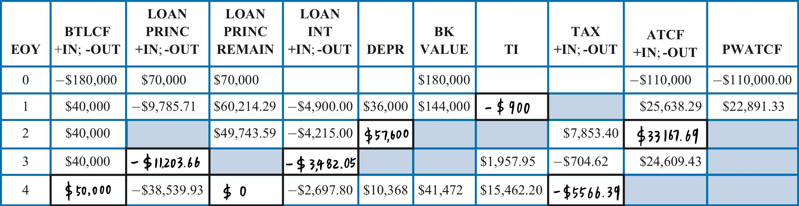

# Problem 37

## a

$$
\begin{align*}
{TI}&=BT\&LCF-{Depreciation\ Allowance}-IPMT\\
&=750000-475000-121465-46750\\
&=\$106,785
\end{align*}
$$

## b

$$
\begin{align*}
T&=TI\times i_{tr}\\
&=106785\times40\%\\
&=\$42,714
\end{align*}
$$

## c

$$
\begin{align*}
ATCF&=BT\&LCF-T-(IPMT+PPMT)\\
&=750000-475000-42714-46750-85000\\
&=\$100,536
\end{align*}
$$

# Problem 39

## a

$$
\begin{align*}
{TI}&=BT\&LCF-{Depreciation\ Allowance}-IPMT\\
328000&=X-360000-1800000\times45\%\times12.5\%\\
X&=\$789,250
\end{align*}
$$

## b

$$
\begin{align*}
T&=TI\times i_{tr}\\
&=328000\times40\%\\
&=\$131,200
\end{align*}
$$

## c

$$
\begin{align*}
ATCF&=BT\&LCF-T-(IPMT+PPMT)\\
&=789250-131200-1800000\times45\%\times(12.5\%+25\%)\\
&=\$354,300
\end{align*}
$$

# Problem 47

## b

$$
\begin{align*}
25638.29&=22891.33\times(1+MARR)\\
MARR&=12\%
\end{align*}
$$

## c

$$
\begin{align*}
4900&=70000\times(1+I_{loan})\\
I_{loan}=7\%
\end{align*}
$$

## d

$$
\cfrac{36000}{180000}=20\%
\nonumber
$$

5-year Property

## e

$$
\begin{align*}
T_3&=TI_3\times i_{tr}\\
704.62&=1957.95\times i_{tr}\\
i_{tr}&=36\%
\end{align*}
$$

