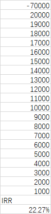

# Problem 7

|   EOY   |   0    |   1   |   2    |   3   |   4    |   5   |   6    |
| :-----: | :----: | :---: | :----: | :---: | :----: | :---: | :----: |
| **NCF** | -\$100 | \$800 | -\$750 | \$900 | -\$950 | \$700 | -\$800 |
| **SUM** | -\$100 | \$700 | -\$50  | \$850 | -\$100 | \$600 | -\$200 |

## a

There are 6 sign changes, which indicates that there will be 6, 4, 2 or 0 positive real roots.

## b

Tells nothing.

Since Nordtrom's Criterion is **sufficient but not necessary**:

The converse of nordtrom's criterion:

- if there exists a unique positive real root, then the cumulative cash flow begins with a negative value and changes only once to a positive-valued series

cannot be determined.

Therefore, the contrapositive of converse proposition (the inverse of nordtrom's criterion):

- if the cumulative cash flow **does not begin with a negative value** or **does not change**  or **changes more than once to a positive-valued series**, then there exists **no positive real root** or **more than one positive real root**

cannot be determined.

Therefore, the negation of the inverse of nordtrom's criterion:

- if the cumulative cash flow **does not begin with a negative value** or **does not change**  or **changes more than once to a positive-valued series**, then there exists a unique positive real root

cannot be determined.

So we cannot determine whether the positive real root exists and how many roots there are, if the cumulative cash flow changes more than once to a positive-valued series.

## c

Using Excel function `IRR` , the result is 8.84%.

Using Excel solver with method GRG Nonlinear, the result are 8.84% and 609.77% (may not be collectively exhaustive).

Result from WolframAlpha:

## d

$$
{PW}=\sum_{t=0}^{n}A_t\times(1+MARR)^{-t},
\ \mbox{where}\ n=6,\ MARR=10 \%
\tag1
$$

$$
{PW}=$17.82
\tag2
$$

Yes.

# Problem 9

This question implies that the cash flow series of the project have one unique IRR. The IRR must be less than MARR to make it breakeven. Therefore, the first digit can only be 1.
$$
{IRR}=12\%
$$

# Problem 11

# Problem 13

## (1)

$$
{PW}=-70000+(P|A\ 10\%,\ 20)\times20000-(P|G\ 10\%,\ 20)\times1000
\tag1
$$

$$
{PW}=$44,864.36
\tag2
$$

## (2)

Should be undertaken.

## (3)

REcommend the investment if IRR >= MARR.

# Problem 35

## a

Alternative W and Y.

## b

### iteration 0

current best: Y

challenger: X
$$
{IRR}_{X-Y}<MARR
\tag1
$$
fails to challenge.

### iteration 1

current best: Y

challenger: W
$$
{IRR}_{W-Y}<MARR
\tag2
$$
fails to challenge.

### iteration 2

current best: Y

challenger: Z
$$
{IRR}_{Z_Y}>MARR
\tag3
$$
Z become current best.

Z should be select.
